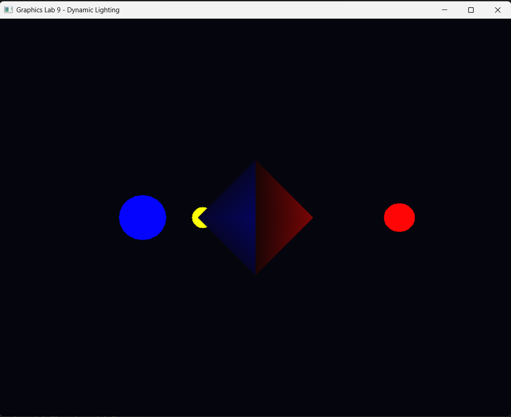
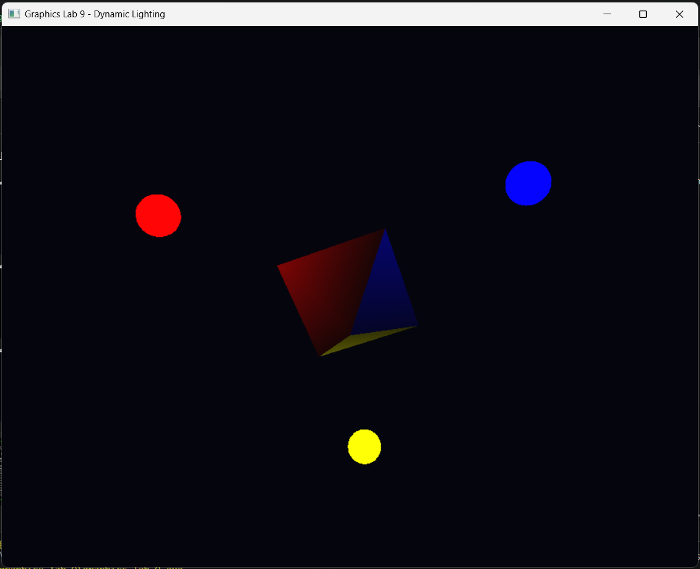
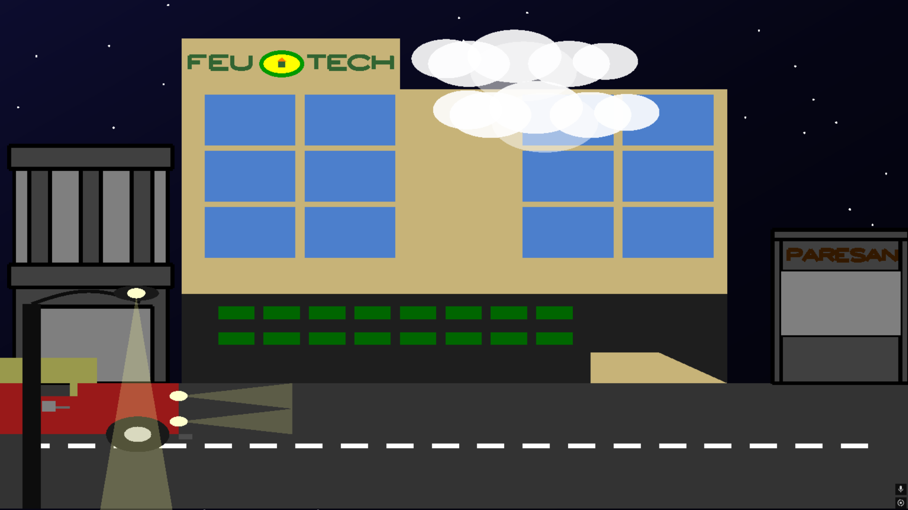
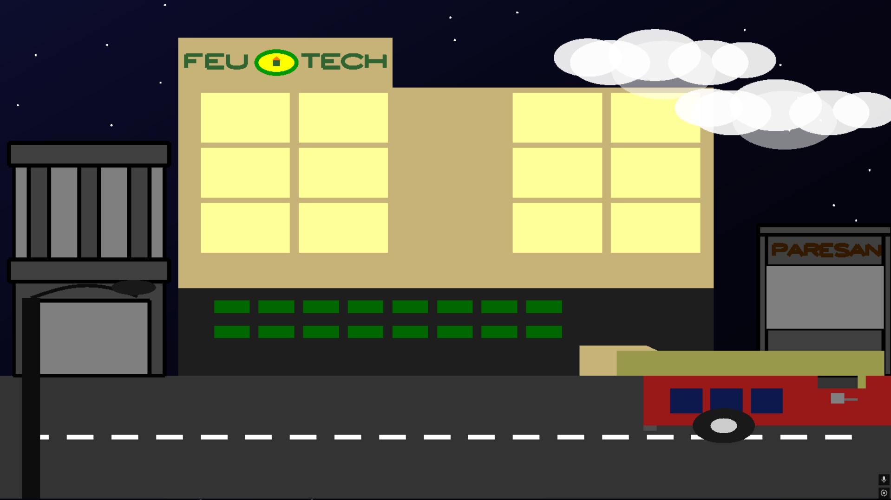

# Computer Graphics and Visual Computing Projects

A curated collection of C++ computer graphics projects built with OpenGL, GLUT/FreeGLUT, and GLEW.

This repository contains two visual computing projects: a 2D animated night city scene and a 3D dynamic lighting demo with a rotating diamond and colored light sources.

## Projects Included

### 1. Final Project - Night City Scene

A 2D OpenGL animated city scene featuring an FEU Tech building, moving jeepney, clouds, stars, road, streetlight, and interactive lighting toggles.

### 2. Graphics Lab 9 - Dynamic Lighting

A 3D OpenGL lighting demo featuring a faceted diamond and three colored light spheres. The user can move the camera, rotate the view, and rotate the diamond-light setup.

## Features

- 2D and 3D OpenGL rendering
- Animated night city environment
- Moving jeepney and clouds
- Toggleable building window lights
- Toggleable streetlight
- 3D diamond model
- Red, blue, and yellow light sources
- Camera movement controls
- Object rotation controls
- Keyboard and mouse interaction

## Technologies Used

- C++
- OpenGL
- GLUT / FreeGLUT
- GLEW
- MSYS2 UCRT64
- MinGW g++
- Git and GitHub

## Project Structure

```text
cpp-computer-graphics-visual-computing/
├── .gitignore
├── README.md
├── assets/
│   ├── sample-output.png
│   ├── sample-output2.png
│   ├── sample-output3.png
│   └── sample-output4.png
├── final-project/
│   ├── README.md
│   └── main.cpp
└── graphics-lab-9/
    ├── README.md
    └── main.cpp
```

## How to Run

This project was tested using MSYS2 UCRT64 on Windows.

### Requirements

- Git
- MSYS2 UCRT64
- MinGW g++
- FreeGLUT
- GLEW

Install the required OpenGL libraries in the MSYS2 UCRT64 terminal:

```bash
pacman -S mingw-w64-ucrt-x86_64-freeglut mingw-w64-ucrt-x86_64-glew
```

Check if the compiler is available:

```bash
g++ --version
```

### Clone the Repository

```bash
git clone https://github.com/TimNieto/cpp-computer-graphics-visual-computing.git
cd cpp-computer-graphics-visual-computing
```

### Run Final Project

Compile:

```bash
g++ ./final-project/main.cpp -o ./final-project/final-project.exe -lfreeglut -lglew32 -lopengl32 -lglu32
```

Run:

```bash
./final-project/final-project.exe
```

Controls:

```text
Left Click   - Toggle building window lights
Right Click  - Toggle streetlight
Alt + F4     - Exit fullscreen window
```

### Run Graphics Lab 9

Compile:

```bash
g++ ./graphics-lab-9/main.cpp -o ./graphics-lab-9/graphics-lab-9.exe -lfreeglut -lopengl32 -lglu32
```

Run:

```bash
./graphics-lab-9/graphics-lab-9.exe
```

Controls:

```text
W / A / S / D    - Move camera
Q / E            - Move camera down/up
Arrow Keys       - Rotate camera view
I / J / K / L    - Rotate diamond and light setup
Esc              - Close window
```

## Sample Output

### Graphics Lab 9 - Rotated Diamond Lighting View



### Graphics Lab 9 - Dynamic Lighting Demo



### Final Project - Night City Scene



### Final Project - Interactive Lighting Toggle



## Notes

- Generated `.exe` files are ignored and should not be committed.
- The project uses OpenGL fixed-function pipeline concepts.
- The final project focuses on 2D scene composition and animation.
- Graphics Lab 9 focuses on 3D transformations, camera movement, normals, materials, and colored lighting.

## Future Improvements

- Add texture mapping for buildings and vehicles
- Add smoother animation controls
- Add more lighting modes
- Add camera reset controls
- Add configurable scene settings
- Improve cross-platform build instructions with CMake

## License

This project is for educational and portfolio purposes only. All rights are reserved.

You may view the source code, but you may not copy, modify, distribute, or use this code without permission from the author.

## Author

Created by Tim Nieto.
